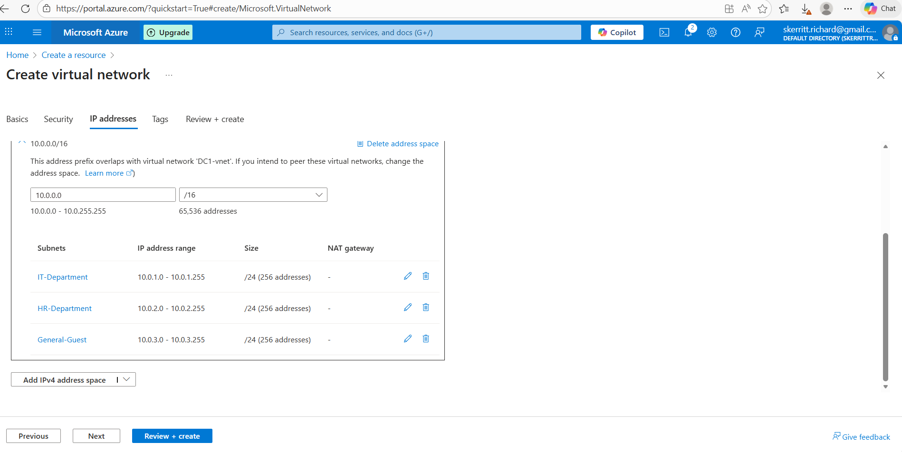
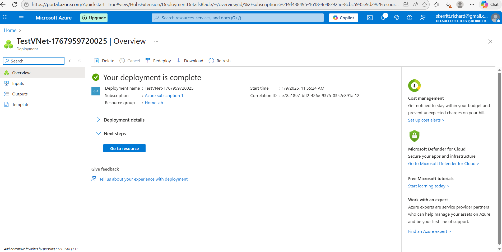
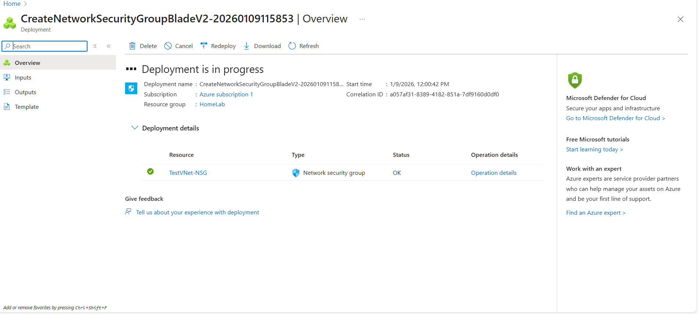
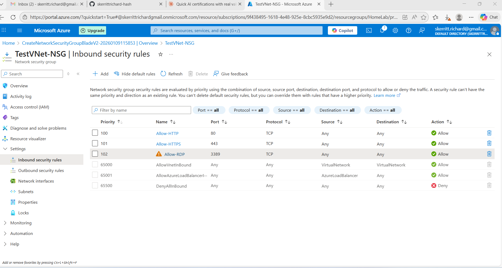

# Azure Networking Lab - Virtual Networks & Network Security Groups

## Overview

This lab demonstrates practical hands-on experience with Azure networking fundamentals. I built a functional Virtual Network (VNet) with multiple subnets and configured Network Security Groups (NSGs) to control traffic flow, applying core networking concepts from the AZ-900 certification.

This project shows understanding of:
- Virtual Network architecture
- Subnet segmentation and IP addressing
- Network Security Groups and firewall rules
- Inbound and outbound traffic control
- Real-world security implications

---

## Architecture

### Virtual Network (VNet)

**Name:** TestVNet
**Address Space:** 10.0.0.0/16 (65,536 total IP addresses)
**Region:** UK West
**Resource Group:** HomeLab

### Subnet Design

The VNet is segmented into 3 subnets, demonstrating logical network division by department:

| Subnet Name | Address Range | Size | Purpose |
|------------|---------------|------|---------|
| IT-Department | 10.0.1.0 - 10.0.1.255 | /24 (256 addresses) | IT infrastructure and servers |
| HR-Department | 10.0.2.0 - 10.0.2.255 | /24 (256 addresses) | HR department resources |
| General-Guest | 10.0.3.0 - 10.0.3.255 | /24 (256 addresses) | General use and guest access |

### Network Security Group (NSG)

**Name:** TestVNet-NSG
**Purpose:** Firewall - controls inbound and outbound traffic
**Location:** Azure subscription 1

---

## Networking Concepts Applied

### 1. Virtual Networks (VNets)

A VNet is a logically isolated network in Azure where you can launch resources. Think of it as your private cloud network.

**Key characteristics:**
- Isolated from other networks
- Can be segmented into subnets
- Connected to other VNets or on-premises networks via VPN/ExpressRoute
- Controlled by Network Security Groups

**Why it matters:**
- Provides security isolation
- Enables network segmentation
- Foundation for cloud infrastructure
- Allows IP address space management

### 2. Subnets

Subnets are logical subdivisions of a VNet's address space, allowing further segmentation.

**Benefits:**
- **Organization:** Different departments/functions in different subnets
- **Security:** Apply different security policies to each subnet
- **Scalability:** Manage IP addressing per subnet
- **Resource isolation:** Separate resources by business unit

**In this lab:**
- IT-Department subnet for IT infrastructure
- HR-Department subnet for HR resources
- General-Guest subnet for general/guest access

This mimics enterprise network design where different departments have separate network resources.

### 3. Network Security Groups (NSGs)

NSGs are firewalls that control inbound and outbound traffic using rules.

**How they work:**
- Rules are evaluated by **priority** (lowest number = highest priority)
- First matching rule is applied
- Can allow or deny traffic
- Applied to subnets or network interfaces

**Rule components:**
- **Source:** Where traffic comes FROM (IP, CIDR, Service Tag)
- **Source Port:** Which port traffic originates FROM (usually * for any)
- **Destination:** Where traffic goes TO
- **Destination Port:** Which port traffic targets (e.g., 80, 443, 3389)
- **Protocol:** TCP, UDP, ICMP, or Any
- **Action:** Allow or Deny
- **Priority:** Rule evaluation order (100-4096)

### 4. IP Addressing Strategy

**Public vs Private IP:**

In Azure (like any network):
- **Private IPs:** Internal to the VNet, not routable on the internet
  - Format: 10.0.0.0/16 in this lab
  - Used for VM-to-VM communication within the VNet
  
- **Public IPs:** Routable on the internet
  - Assigned to resources that need internet access
  - Allows external connectivity
  - Requires NSG rules to control access

**This lab uses:**
- Private IP range: 10.0.0.0/16 (RFC 1918 private range)
- Subnets within this range: 10.0.1.0/24, 10.0.2.0/24, 10.0.3.0/24

---

## Inbound Security Rules Configured

### Rule 1: Allow-HTTP

| Property | Value |
|----------|-------|
| Priority | 100 |
| Name | Allow-HTTP |
| Port | 80 |
| Protocol | TCP |
| Source | Any |
| Action | Allow |
| Purpose | Allow inbound web traffic (HTTP) |

**Use case:** Web servers in any subnet can receive HTTP requests from the internet.

### Rule 2: Allow-HTTPS

| Property | Value |
|----------|-------|
| Priority | 101 |
| Name | Allow-HTTPS |
| Port | 443 |
| Protocol | TCP |
| Source | Any |
| Action | Allow |
| Purpose | Allow inbound encrypted web traffic (HTTPS) |

**Use case:** Secure web traffic to applications.

### Rule 3: Allow-RDP

| Property | Value |
|----------|-------|
| Priority | 102 |
| Name | Allow-RDP |
| Port | 3389 |
| Protocol | TCP |
| Source | Any |
| Action | Allow |
| Purpose | Allow Remote Desktop Protocol connections |

**⚠️ Security Note:** This rule allows RDP from ANY source on the internet, which is why Azure displays an amber warning. This is acceptable for a lab environment but would require restriction in production (e.g., source limited to specific IP addresses).

### Default Rules

Azure automatically includes default rules:
- **AllowVNetInBound (Priority 65000):** Allows communication within the VNet
- **AllowAzureLoadBalancerInbound (Priority 65001):** Allows Azure Load Balancer traffic
- **DenyAllInBound (Priority 65500):** Default deny for anything not explicitly allowed

---

## Outbound Rules

Default Azure outbound rules allow:
- **AllowVNetOutBound:** VMs can communicate within the VNet
- **AllowInternetOutBound:** VMs can communicate with the internet
- **DenyAllOutBound:** Default deny (overridden by above rules)

---

## Real-World Application

### Small Company (20 people)
- Single subnet sufficient
- Simple NSG rules for web/RDP access
- Minimal complexity

### Medium Company (500 people)
- Multiple subnets by department (IT, HR, Finance, Sales)
- Different NSG rules per subnet
- IT subnet: More permissive for infrastructure
- HR/Finance subnets: More restrictive for compliance

### Large Enterprise (5000+ people)
- Multiple VNets per region
- Hub-and-spoke topology
- Advanced NSG rules with service tags
- Azure Firewall for centralized control
- DDoS Protection Standard enabled

**This lab demonstrates medium company thinking** with departmental subnet separation.

---

## Security Considerations

### What's Secure About This Lab

✅ VNet isolation from the internet (private network)
✅ Subnet segmentation by department
✅ Explicit allow rules (deny by default)
✅ Priority-based rule evaluation
✅ Specific ports opened (HTTP, HTTPS, RDP only)

### What Would Be Different in Production

⚠️ RDP rule would restrict source to specific IPs, not "Any"
⚠️ Azure Firewall for centralized control
⚠️ DDoS Protection Standard enabled
⚠️ VNet peering with other corporate networks
⚠️ VPN Gateway for on-premises connectivity
⚠️ Network monitoring and logging enabled
⚠️ Regular NSG rule audits

---

## Screenshots

### VNet and Subnet Configuration

Shows TestVNet with three subnets (IT-Department, HR-Department, General-Guest) and their respective IP ranges.

### VNet Deployment Complete

Successful deployment of TestVNet with all 3 subnets to Azure.

### NSG Deployment Complete

Network Security Group created and ready for rule configuration.

### NSG Inbound Rules

Configured inbound firewall rules showing HTTP (port 80), HTTPS (port 443), and RDP (port 3389) access.

---

## Tools & Technologies Used

- **Azure Portal:** Web interface for creating and managing resources
- **Virtual Networks:** Azure networking service
- **Network Security Groups:** Azure firewall service
- **Subnets:** VNet segmentation
- **Azure Subscription:** Free tier account

---

## Learning Outcomes

This lab demonstrates:

✅ Understanding of Azure Virtual Networks
✅ Subnet design and IP address planning
✅ Network Security Group configuration
✅ Firewall rule design and priority
✅ Security implications of network settings
✅ Real-world network architecture thinking
✅ Connection to AZ-900 networking concepts

---

## Skills Demonstrated

- **Cloud Networking:** VNet creation and configuration
- **Network Design:** Logical segmentation by department
- **Security:** NSG rules and firewall concepts
- **IP Addressing:** CIDR notation and subnet planning
- **Azure Portal:** Resource creation and management
- **Security Awareness:** Understanding public/private IPs and RDP risks
- **Documentation:** Clear explanation of networking decisions

---

## Future Enhancements

- Attach subnets to the NSG
- Deploy VMs to each subnet
- Test network connectivity between subnets
- Configure User-Defined Routes (UDRs)
- Implement Azure Firewall
- Enable Network Watcher monitoring
- Add service endpoints for Azure services
- Configure VPN Gateway for on-premises connectivity

---

## Key Takeaways

1. **VNets provide isolation** - Your cloud network is separate from other organizations
2. **Subnets enable segmentation** - Organize resources by department/function
3. **NSGs are firewalls** - Control exactly what traffic is allowed in/out
4. **Security by default** - Rules are evaluated in priority order, default deny
5. **Real-world thinking** - Lab design mirrors enterprise network architecture

---

## References

- [Azure Virtual Networks Documentation](https://docs.microsoft.com/en-us/azure/virtual-network/)
- [Network Security Groups Overview](https://docs.microsoft.com/en-us/azure/virtual-network/network-security-groups-overview)
- [Azure Networking Best Practices](https://docs.microsoft.com/en-us/azure/cloud-adoption-framework/ready/azure-best-practices/network-security-best-practices)
- [AZ-900 Networking Concepts](https://docs.microsoft.com/en-us/learn/modules/describe-azure-identity-access-security/)
